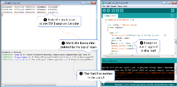
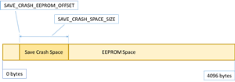
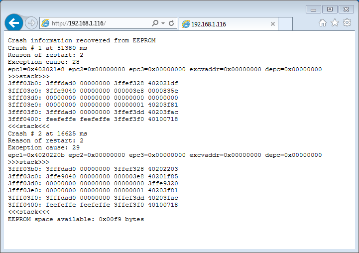

# EspSaveCrash [](https://travis-ci.org/krzychb/EspSaveCrash)

Save exception details and stack trace anytime and anywhere the ESP8266 crashes. Implement it in your sketch in two simple steps.


## Overview

Do you face random crashes of ESP8266? Do you have difficulty to capture diagnostic information because module is in remote location? Or maybe module crashes after several hours of operation and it is inconvenient to keep serial monitor open until it fails?

EspSaveCrash is a handy little library that will keep automatically catching and saving crash information to ESP8266 module's flash in case it fails due to exception or software WDT. You will then be able to analyze the crash log and decode the stack trace using [ESP Exception Decoder](https://github.com/me-no-dev/EspExceptionDecoder).

You will implement it in your sketch in two simple steps:

1. Include the library
  ```cpp
  #include "EspSaveCrash.h"
  ```

2. Declare object
  ```cpp
EspSaveCrash SaveCrash;
```

3. Print out saved crash details
  ```cpp
  SaveCrash.print();
  ```

To clear existing crash history from the flash use `SaveCrash.clear()`.

Check section [Quick Start](quick-start.md) for sample implementation of this library and tracking down where the program crash happened. More code samples are available in section [Examples](examples.md), that also covers access to saved information remotely with a web browser.  

| [](quick-start.md) | [](examples.md) |
| :---: | :---: |
| [Quick Start](quick-start.md) | [Code Examples](examples.md) |


## Compatibility

* Library works with any ESP8266 module programmed using [esp8266 / Arduino](https://github.com/esp8266/Arduino) core.


## Functionality

* Registers callback to automatically capture and save crash details
* Captures several crashes to save them to ESP8266 module's flash
* Captures exceptions and software WDT restarts (not hardware WDT)
* The following information is saved:
  * Time of crash using the ESP's milliseconds counter
  * Reason of restart - see [rst cause](https://arduino-esp8266.readthedocs.io/en/latest/boards.html#rst-cause)
  * Exception cause - see [EXCCAUSE](https://arduino-esp8266.readthedocs.io/en/latest/exception_causes.html)
  * `epc1`, `epc2`, `epc3`, `excvaddr` and `depc`
  * Stack trace in format you can analyze with [ESP Exception Decoder](https://github.com/me-no-dev/EspExceptionDecoder)
* Automatically arms itself to operate after each restart or power up of module
* Saves crash details within defined flash space and then stops

Example output of `SaveCrash.print()`:




## Examples

Library comes with [example sketches](https://github.com/krzychb/EspSaveCrash/tree/master/examples) that let you trigger some exceptions and see how to visualize saved data. 

Please check separate section [how to use example sketches](examples.md) and what particular functionality they provide.


## Tested With

### Arduino Core

* [Esp8266 / Arduino](https://github.com/esp8266/Arduino) core [2.6.1](https://github.com/esp8266/Arduino/releases/tag/2.6.1) for Arduino IDE and Visual Micro
* [framework-arduinoespressif](http://platformio.org/platforms/espressif) version 13 for PlatformIO


### Programming Environment

* [Arduino IDE](https://www.arduino.cc/en/Main/Software) 1.8.10 portable version running on Windows 7 x64 and Linux Ubuntu 18.04 LTE
* [PlatformIO IDE](http://platformio.org/platformio-ide) 1.3.0 CLI 2.11.0 running on Windows 7 x64
* [Visual Micro](http://www.visualmicro.com/) 1606.17.10 with Visual Studio Community 2015 running on Windows 7 x64


## Installation

* Arduino IDE - use [Library Manager](https://www.arduino.cc/en/Guide/Libraries#toc2) in Arduino IDE and search for *EspSaveCrash*.
* PlatformIO IDE - use PlatformIO's [Library Manager](http://docs.platformio.org/en/stable/librarymanager/). In particular execute `pio lib install 376`.
* Visual Micro - installation procedure is the same as for Arduino IDE above.


## Contribute

Feel free to contribute to the project in any way you like! 

If you find any issues with code or descriptions please report them using *Issues* tab above. 


## Author

krzychb


## Credits

* Preparation of this library has been inspired by issue [#1152](https://github.com/esp8266/Arduino/issues/1152) in [esp8266 / Arduino](https://github.com/esp8266/Arduino) repository.
* Development was possible thanks to [Ivan Grokhotkov](https://twitter.com/i_grr), who clarified how to register a crash callback and suggested to save crash information on flash. 
* Actual implementation of library has been done thanks to [djoele](https://github.com/djoele) who provided first working code and suggested to convert it into general functionality.
* Thanks to contribution by [Juan L. Pérez Díez](https://github.com/jlpdiez) the library accepts offset and size parameters passed into the constructor.
* With kind contribution by [brainelectronics](http://www.brainelectronics.de/) the crash log can be stored to char buffer for more convenient use with a web server.
* [Oxan van Leeuwen](https://github.com/oxan) brought nice code improvements, intoduced size buffer check to prevent the buffer overflow and fixed some spelling errors.


## License

[GNU LESSER GENERAL PUBLIC LICENSE - Version 2.1, February 1999](LICENSE)
